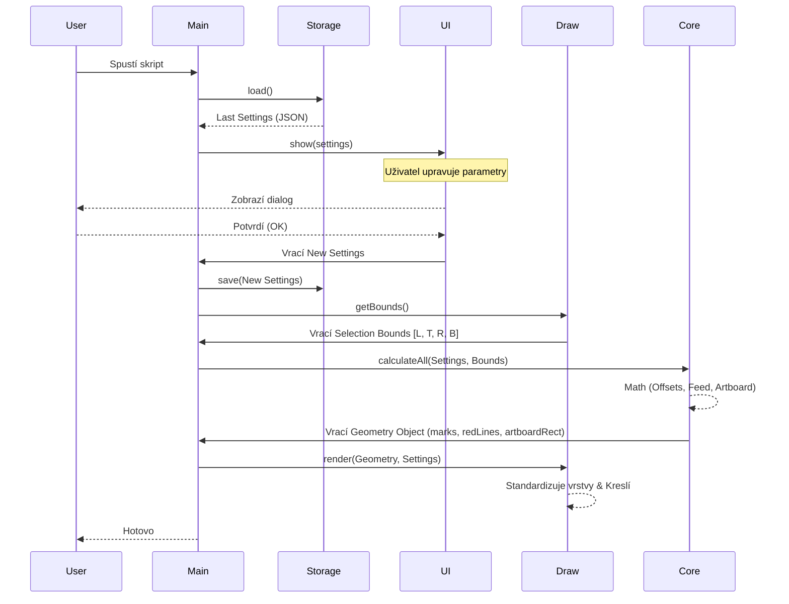

# Architecture: Print Marks Automation (v26.3)

> **Verze:** v26.3 (As-Built)
> **Architektura:** Single-File Namespace Pattern (ES3 Compatible)

## 1. Architektonický Vzor: Namespace Pattern

Vzhledem k omezením prostředí ExtendScript (ES3) využíváme **Namespace Pattern**. Celá aplikace je zapouzdřena v globálním objektu `PMA`, což zabraňuje konfliktům v globálním prostoru Illustratoru.

### Struktura Modulů

```javascript
var PMA = {
  // Root Namespace
  Config: {},
  Storage: {},
  Core: {},
  UI: {},
  Draw: {},
  Main: function () {},
};
```

#### 🛠️ 1. PMA.Config (Configuration)

- **Účel:** Definuje veškeré konstanty, textové řetězce (UI labels) a výchozí hodnoty.
- **Obsah:**
  - `scriptName`: Identifikace verze (např. "Zund & Summa v26.0 RC1").
  - `ui`: Lokalizované texty pro dialogy.
  - `defaults`: Výchozí nastavení pro první spuštění.

#### 💾 2. PMA.Storage (Persistence)

- **Účel:** Ukládání a načítání uživatelského nastavení mezi spuštěními.
- **Mechanismus:** Používá `Folder.userData` a JSON serializaci.
- **Soubor:** `~/Library/Application Support/PMA/settings_v26_2.json` (Mac/Win).

#### 🧠 3. PMA.Core (Pure Business Logic)

- **Účel:** Čistá matematika. Nezávisí na Illustrator DOMu.
- **Klíčové Funkce:**
  - `calculateAll(settings, bounds)`: Hlavní výpočetní jednotka. Vrací kompletní geometrii (pozice značek, linek, artboardu).
  - **Artboard Logic:** Počítá nový Artboard `[L, T, R, B]` relativně k souřadnicím grafiky, aby se zabránilo posunům ("plavání").
  - **Feed Logic:** Aplikuje asymetrické okraje (Horní/Spodní výjezd).

#### 🖥️ 4. PMA.UI (User Interface)

- **Účel:** Vykreslení ScriptUI dialogu.
- **Design Pattern:** "Unified Panel Layout".
  - Dialog má fixní šířku (350px).
  - Používá dynamické přepínání viditelnosti řádků (Rows) místo celých panelů, což eliminuje "skákání" okna.
  - Helper funkce `addRow` a `addLayerRow` pro konzistentní vzhled.

#### 🎨 5. PMA.Draw (Illustrator DOM API)

- **Účel:** Manipulace s dokumentem AI.
- **Layer Management (v26.3):**
  - **Strict Mode:** Vylváří pouze vrstvy (`Thru-cut`, `Kiss-cut`), které uživatel explicitně povolil.
  - **Graphics Standard:** Místo vytváření nové vrstvy `Graphics` identifikuje nejspodnější vrstvu, přejmenuje ji, odemkne a přesune dospodu.
- **Rendering:** Kreslí značky (Ellipse/Rectangle) a ořezové linky (Red Lines) do příslušných vrstev.

## 2. Data Flow (Tok Dat)



## 3. Error Handling Strategy

- **Global Try/Catch:** Celá funkce `Main` je v bloku `try/catch` pro zachycení kritických chyb (např. chybějící oprávnění k souborům).
- **JSON Polyfill:** Protože ES3 nemá nativní JSON, skript obsahuje robustní polyfill.
- **Layer Fallback:** Pokud skript nenajde požadovanou Spot Color, vypíše varování do pole `warnings`, ale nezastaví se (Non-blocking alert).
